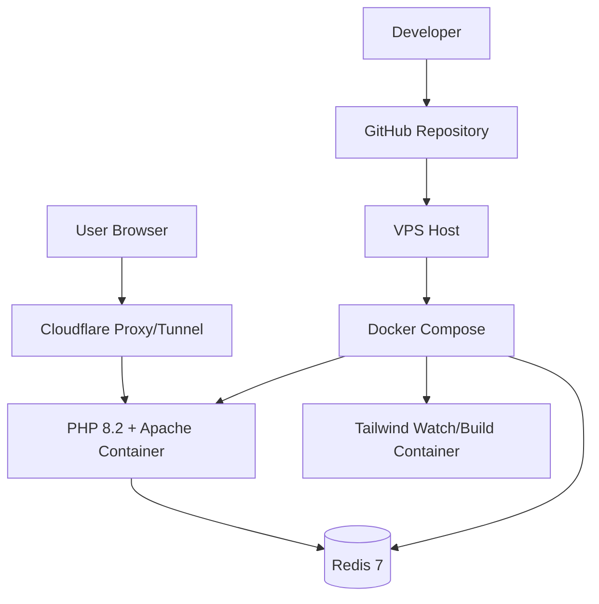

# System Architecture

## High-Level Architecture

## Runtime Components

### 1. Web App (`app`)
- Base image: PHP 8.2 + Apache
- Apache `DocumentRoot`: `/var/www/html/public`
- Enabled modules: `rewrite`, `headers`
- PHP extension: `redis` (installed via PECL)
- Handles routes from `public/routes.php`

### 2. Redis (`redis`)
- Image: `redis:7-alpine`
- Persistence: AOF (`redis-server --appendonly yes`)
- Volume: `redis_data`
- Usage: unique visitor counter (`/api/counter`)

### 3. Tailwind (`tailwind`)
- Image: `node:20-alpine`
- Runs `npm install && npm run tw:watch`
- Compiles CSS from source to app assets

## Request Flow

1. Browser requests `/`.
2. Router dispatches request in `public/router.php` + `public/routes.php`.
3. View `public/views/index.php` renders blueprint template and sections.
4. Counter widget calls `/api/counter`.
5. API hashes client identity (`IP + User-Agent`) and updates Redis set.
6. API returns current unique visitor count as JSON.

## Routing and Rendering

- Entry: `public/routes.php`
- Router core: `public/router.php`
- Main view: `public/views/index.php`
- Template shell: `templates/blueprint.php`
- Loader and startup animation: `templates/loading.php`
- Sections: `public/views/components/sections/*`

## Data and State

- Persistent app state currently limited to Redis visitor set.
- No relational DB in production path yet.
- Visitor uniqueness key: SHA-256 hash of `ip|user-agent`.

## Build and Delivery

- Source styles: `public/assets/css/input.css`
- Watch build: `npm run tw:watch`
- Minified build: `npm run tw:build`
- Container orchestration: `docker-compose.yml`

## Non-Functional Characteristics

- Availability: designed for VPS + Cloudflare Tunnel deployment
- Security baseline:
  - hidden origin through Cloudflare
  - no direct dependency on public app port exposure
- Performance baseline:
  - Lighthouse local audit generated in `tests/lighthouse/audit-latest.json`
  - Lighthouse HTML report in `tests/lighthouse/audit-latest.html`

## Roadmap / Future Improvements

- CI/CD workflow not yet automated
- Centralized logs/monitoring not configured
- No relational DB schema/migrations yet
- Hardening of input validation still in backlog
